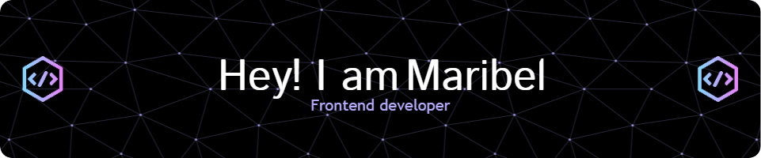

# Hello! I'm Maribel 👋

I am a junior frontend developer focused on web development with **React**. I am passionate about creating interactive experiences, and I am currently improving my skills in technologies such as **React**, **JavaScript**, **Vite**, and **Tailwind CSS**. <!-- I am also developing personal projects like **Mallorca Planner**, an application designed for Japanese tourists who want to explore the beautiful island of Mallorca. -->

## 🔧 Technologies & Tools

## 📊 GitHub Stats

  
  

## 🌱 Recent Projects

- **[Fitness Planner](https://github.com/IMMaribel/fitness-planner-reactplugins-mysql)**: An app to help plan gym routines, created with **React** and **Node.js**.

## 💬 About Me

- 🌍 I live in **Barcelona, Spain**.
- 💻 I am currently training to become a **Frontend Developer** and I love learning new technologies and improving my skills.
- 🚀 I am open to collaborating on projects related to **React** or anything interesting.

## 📫 Contact

- [LinkedIn](https://www.linkedin.com/in/immaribel7/)
- [Email](immaribel7@gmail.com)

## 🚀 My Goals

- **Short-term**: Improve my skills in **React** and deepen my knowledge of **Node.js**.
- **Long-term**: Become a **Full Stack Developer** and contribute to open source projects related to accessibility.

## 🔗 Other Resources

  If you like my work, feel free to ⭐️ my repositories!

